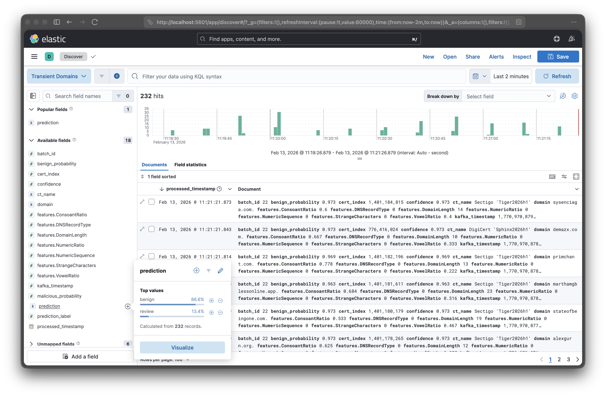

# Transient Domain Detector

Real-time pre-screening and early warning system for potential transient domains - ultra-short-lived malicious domains that exist for less than 24 hours and evade traditional DNS monitoring. Provides first-line detection and risk assessment to enable comprehensive transient domain tracking.

**Inspired by:** [DarkDNS: Revisiting the Value of Rapid Zone Update](https://doi.org/10.1145/3646547.3689021) (Sommese et al., IMC 2024)  
**Data Source:** [OpenINTEL ZoneStream](https://openintel.nl/data/zonestream/) - Public feed of newly registered domains from CT logs

## 🎯 What Are Transient Domains?

**Transient domains** are domain names that are registered and deleted within a 24-hour period, making them invisible to conventional security monitoring tools that rely on daily zone file snapshots (such as ICANN's CZDS - Centralized Zone Data Service).

### Key Characteristics (from DarkDNS Research)

- ⏱️ **Ultra-short-lived**: Over 50% disappear within their first 6 hours of existence
- 🚨 **Predominantly malicious**: Registrars confirm they are "mostly likely malicious" - used for phishing, spam, credit card fraud, and abuse
- 👻 **Invisible to daily monitoring**: Fall entirely between consecutive 24-hour zone snapshots
- 🔒 **Quickly removed**: Registrars delete them upon detecting abuse, suspicious payments, or fraud
- 📊 **Massive blind spot**: Even with best available public data, only ~30% are detected

### The Problem

According to the **DarkDNS paper** (Sommese et al., IMC 2024):

- **68,042 transient domains** identified over just 3 months (Nov 2023 - Jan 2024)
- **42,358 confirmed transient domains** after validation with RDAP data
- **At least 1%** of newly registered domains are transient and never appear in CZDS snapshots
- **Only 5%** of transient domains are caught by blocklists
- **94%** of flagged transient domains appear on blocklists only **after deletion** (too late)
- Even commercial passive DNS feeds (DomainTools SIE) combined with CT logs still miss significant portions

**Critical Visibility Gap**:
- Traditional DNS monitoring relies on **daily snapshots** and completely misses transient domains
- Commercial threat intelligence captures only a **fraction** of them
- Security teams have **no real-time visibility** into these threats
- By the time they're detected (if ever), they're already gone
- Each registrar independently fights the same threats as attackers move between registrars

### Our Solution

This system provides **real-time pre-screening and early warning** for potentially transient domains by:
1. ✅ Monitoring newly registered domains from **Certificate Transparency logs** in real-time
2. ✅ Extracting **linguistic and statistical features** instantly
3. ✅ Classifying domains using **Machine Learning** (Random Forest classifier)
4. ✅ Flagging suspicious domains as **"malicious"** or **"needs review"**
5. ✅ Providing **early warning** for security teams and researchers who can:
   - Check daily zone file snapshots to confirm if domains are truly transient
   - Investigate flagged domains more thoroughly
   - Take proactive blocking/monitoring actions

**What This System Does**:
- 🎯 **Pre-screens** newly registered domains for suspicious characteristics
- 🚨 **Flags** high-risk domains that exhibit transient-like patterns
- ⚡ **Provides immediate alerts** (within seconds of registration)
- 📊 **Risk assessment** - not definitive confirmation

**What This System Doesn't Do**:
- ❌ Does **not** confirm if domains are actually transient (would require checking zone files 24h later)
- ❌ Does **not** access daily zone file snapshots
- ❌ Does **not** track domain lifecycle/deletion

This is a **first-line detection** tool that gives security teams a "heads up" about suspicious domains that warrant further investigation.

---

## 🎯 System Overview

This system monitors newly registered domains from [**OpenINTEL's ZoneStream**](https://openintel.nl/data/zonestream/) (University of Twente) Kafka stream, extracts features, classifies them using a trained ML model, and stores results in Elasticsearch for real-time analysis.

**Real-Time Pre-Screening Pipeline**:
- Processes domains **within seconds** of their first appearance in Certificate Transparency logs
- Identifies suspicious patterns that indicate **potential** transient/malicious behavior
- Flags high-risk domains that warrant further investigation
- Provides **early warning** to security teams and researchers
- Enables downstream systems to investigate (zone file monitoring, WHOIS checks, etc.)

### Architecture

```
Certificate Transparency Logs (Public, Worldwide)
         ↓
OpenINTEL ZoneStream (Kafka) - Based on DarkDNS methodology
[Detects ~42% of newly registered domains within 45 min median]
         ↓
   Spark Streaming - Process domains within seconds
         ↓
  Feature Extraction - Extract 7 important domain features
         ↓
   ML Classification (Random Forest)
   ├─ Benign (Label 0): High-confidence legitimate
   ├─ Malicious (Label 1): Clear threat indicators
   └─ Review (Label 2): Low-confidence (<80%), needs investigation
         ↓
    Elasticsearch - Store & index results
         ↓
  Kibana Dashboard - Real-time monitoring & alerts
         ↓
[Optional: Feed to zone monitoring + RDAP validation
 to confirm transience per DarkDNS full workflow]
```

**Detection Speed** (from DarkDNS research):
- **50% of domains** detected within **45 minutes** of registration
- **30% of domains** detected within **15 minutes** of registration
- Varies by TLD (e.g., .com updates every 60s, others every 15-30 min)

### Why This Matters

**Traditional DNS Monitoring** (Daily Snapshots - ICANN CZDS):
- ❌ Updates every 24 hours
- ❌ **Completely misses transient domains** that exist between snapshots
- ❌ Reactive - domains are already used in attacks
- ❌ **Misses at least 1%** of all newly registered domains (per DarkDNS research)

**Blocklists** (Reactive Detection):
- ❌ Flag only **5% of transient domains**
- ❌ **94% of detections happen AFTER deletion** (too late to act)
- ❌ Most transient domains never get detected at all

**Our Real-Time Pre-Screening** (Certificate Transparency):
- ✅ **First-line detection** within seconds to minutes of registration
- ✅ Flags suspicious domains that **may be** transient-like
- ✅ Provides **early warning** for further investigation
- ✅ Enables security teams/researchers to:
  - Prioritize which domains to track in zone files
  - Focus resources on high-risk domains (instead of monitoring all 6.8M+ monthly registrations)
  - Take proactive blocking actions based on risk scores
  - Feed into comprehensive transient domain tracking systems

**Complete Transient Domain Detection Workflow** (per DarkDNS):
```
1. CT Logs → Newly registered domains appear (public)
2. Our System → ML-based risk assessment flags suspicious domains
3. Zone File Monitoring → Track flagged domains to confirm <24h deletion
4. RDAP Validation → Confirm registration/deletion timing
5. Action → Block/investigate confirmed transient domains
```

**Research Context**: The DarkDNS study showed that even combining CT logs with commercial passive DNS (DomainTools SIE) only detected **30% of transient domains** compared to registry ground truth. This system provides the critical **CT-based first layer** that security teams can use to prioritize their limited zone monitoring resources.

**Detection Comparison** (from DarkDNS research):

| Detection Method | Coverage | Speed | Cost | Transient Detection |
|-----------------|----------|-------|------|---------------------|
| **Daily Zone Files (CZDS)** | All participating TLDs | 24h delay | Free | **0%** - Completely blind |
| **Blocklists** | Reported domains only | Hours-Days | Free | **5%**, 94% too late |
| **Commercial Passive DNS** | Depends on coverage | Minutes-Hours | $$$ | ~30-40% (partial) |
| **CT Logs (This System)** | All domains w/ certs | Seconds-Minutes | Free | First-line pre-screening |
| **Registry Ground Truth** | Perfect (single TLD) | Real-time | N/A | **100%** (not accessible) |
| **Ideal: RZU Service** | All domains | <5 minutes | TBD | **100%** (not available) |

*Note: The DarkDNS .nl registry comparison (ground truth) found **334 transient domains** in 3 months. CT logs detected only **99 (29.6%)** of those. The remaining 70% had no certificates issued or issued too late.*

## 🎯 Use Cases & Impact

### Security Operations Centers (SOCs)

**Problem**: Traditional DNS blacklists are reactive - domains are listed **after** they've been used in attacks.

**How This Helps**: Provides **early warning and risk assessment**:
- Flags suspicious newly-registered domains within seconds
- Prioritize investigation based on ML risk scores
- Feed flagged domains into zone file monitoring systems
- Enable proactive blocking decisions for high-risk domains
- Reduce time-to-awareness from days/hours to seconds

### Anti-Phishing & Fraud Prevention

**Problem**: Transient domains are heavily used for (confirmed by registrars in DarkDNS study):
- **Credit card fraud** (collect payment, disappear before chargeback)
- **Phishing campaigns** (steal credentials, vanish - average campaign: 21 hours)
- **Spam and scam operations** (hit and run tactics)
- **Account suspensions** (detected abuse, removed immediately)

**DarkDNS Findings**: 
- Registrars confirm transient domains are "mostly likely malicious" with rare legitimate exceptions
- Reasons for early removal: abuse, account suspensions, credit card fraud
- Legitimate cases (domain tasting, cancellation) are "exceptionally rare"

**Solution**: Flag suspicious newly-registered domains for:
- Email gateway filtering
- Browser warnings
- DNS-level blocking
- Threat intelligence feeds

### DNS Abuse Research

**Problem**: Transient domains are severely understudied due to their ephemeral nature and complete invisibility to daily zone snapshots.

**Scale of the Problem** (DarkDNS findings):
- **68,042 transient domains** identified in just 3 months
- **~22,700 per month** on average (likely underestimate - only 30% detection rate)
- **At least 1%** of all newly registered domains never appear in CZDS
- **Each registrar fights independently** - same attackers move across registrars to evade detection

**How This Helps**: Provides the **first layer** of transient domain research:
- Identifies suspicious newly-registered domains in real-time from CT logs
- Provides a **candidate list** for zone file monitoring systems
- Reduces the search space for researchers (flag ~10-15% instead of tracking all 6.8M+ monthly domains)
- Enables researchers to focus zone file tracking on high-risk domains
- Feeds into comprehensive transient domain tracking pipelines (CT → ML → Zone Files → RDAP)
- Pattern analysis of characteristics common to suspicious short-lived domains
- Enables collaboration across registrars to share threat signals

### Real-World Impact

- 🎯 **Risk Assessment**: Identifies suspicious domain patterns using ML classification
- ⚡ **Speed**: Flags domains within 10 seconds of registration
- 🔍 **Coverage**: Monitors all domains in Certificate Transparency logs
- 📊 **Efficiency**: Reduces search space for zone file monitoring by flagging high-risk domains
- 🚨 **Early Warning**: Provides immediate alerts for follow-up investigation
- 🔗 **Integration**: Feeds into comprehensive transient domain tracking systems

**Typical Workflow**:
1. **Our System** flags suspicious domains in real-time (within seconds of CT log appearance)
2. **Security Team** investigates flagged domains or feeds them to zone monitoring systems
3. **Zone File Tracking** confirms which flagged domains are actually transient (disappear <24h)
4. **Action** taken on confirmed transient domains (blocklisting, investigation, reporting)

**Research Context**: According to the DarkDNS study, even combining multiple data sources (CT logs + passive DNS) only detects about 30% of transient domains. This system provides the critical **first layer** of detection from CT logs, which security teams can then validate and act upon.

---

## 📋 Required Setup

### File Structure

Before running the detector, ensure you have the following directory structure:

```
Transient Domain Detector/
├── saved_models/                    # ⚠️ REQUIRED - Create this directory
│   ├── your_model.joblib           # Your trained model file
│   └── your_model_metadata.json    # Model metadata (optional)
├── spark_streaming_app.py
├── feature_extractor.py
├── domain_classifier.py
├── elasticsearch_writer.py
├── view_results.py
├── config.py
├── docker-compose.yml
├── requirements.txt
├── setup.sh
├── run.sh
└── ... (other files)
```

### Getting the Trained Model

**Option 1: Use Pre-trained Model (Recommended)**

1. **Clone or download the [MaliciousDomainDetectorML](https://github.com/GradByte/MaliciousDomainDetectorML) repository**:
   ```bash
   cd /path/to/your/location
   git clone https://github.com/GradByte/MaliciousDomainDetectorML.git
   ```

2. **Train the model** (this creates the model file):
   ```bash
   cd MaliciousDomainDetectorML
   pip install -r requirements.txt
   python malicious_domain_detector.py
   ```
   This will create a `saved_models/` directory with your trained model.

3. **Copy the trained model to this project**:
   ```bash
   # Create saved_models directory if it doesn't exist
   mkdir -p "/path/to/Transient Domain Detector/saved_models"
   
   # Copy the model file
   cp MaliciousDomainDetectorML/saved_models/*.joblib "/path/to/Transient Domain Detector/saved_models/"
   cp MaliciousDomainDetectorML/saved_models/*.json "/path/to/Transient Domain Detector/saved_models/"
   ```

4. **Update the model path in `config.py`**:
   ```python
   MODEL_PATH = "saved_models/malicious_domain_model_YYYYMMDD_HHMMSS.joblib"
   ```
   (Replace with your actual model filename)

**Option 2: Train Your Own Model**

Follow the instructions in the [MaliciousDomainDetectorML repository](https://github.com/GradByte/MaliciousDomainDetectorML) to:
- Customize the model parameters
- Use different features
- Train on your own dataset
- Then copy the resulting model files to `saved_models/`

**⚠️ Important**: The system will not work without a trained model in the `saved_models/` directory!

---

## 🚀 Quick Start

### Prerequisites

- **Python 3.8+**
- **Docker & Docker Compose**
- **8GB RAM minimum** (for Elasticsearch)
- **Internet connection** (to connect to OpenINTEL Kafka stream)
- **Trained ML model** (see [Required Setup](#-required-setup) above)

### Installation

```bash
# 1. Make scripts executable
chmod +x setup.sh run.sh

# 2. Run setup (installs dependencies, starts Elasticsearch & Kibana)
./setup.sh

# 3. Run the detector (processes domains for 1 minute)
./run.sh

# 4. View results
python3 view_results.py
```

### Manual Setup

If you prefer manual setup:

```bash
# 1. Create virtual environment
python3 -m venv venv
source venv/bin/activate

# 2. Install dependencies
pip install -r requirements.txt

# 3. Start Elasticsearch and Kibana
docker-compose up -d

# 4. Wait for services to be ready (30-60 seconds)
curl http://localhost:9200/_cluster/health

# 5. Run the detector
python3 spark_streaming_app.py

# 6. View results
python3 view_results.py
```

## 📁 Project Structure

```
Transient Domain Detector/
├── spark_streaming_app.py       # Main Spark streaming application
├── feature_extractor.py          # Extracts features from domains
├── domain_classifier.py          # ML model wrapper
├── elasticsearch_writer.py       # Writes results to Elasticsearch
├── view_results.py               # Displays results from ES
├── view_results.sh               # Wrapper script for view_results.py
├── test_system.py                # System component testing
├── zonestream.py                 # WebSocket connection (for testing)
├── config.py                     # Configuration settings
├── docker-compose.yml            # Elasticsearch & Kibana setup
├── requirements.txt              # Python dependencies
├── setup.sh                      # Setup script
├── run.sh                        # Run script
├── README.md                     # This file
├── QUICK_START.md                # Quick start guide
├── KIBANA_GUIDE.md               # Kibana dashboard setup guide
├── PREDICTION_LABELS.md          # Classification system reference
└── saved_models/                 # ⚠️ YOU MUST CREATE THIS (see Required Setup)
    ├── your_model.joblib         # Get from MaliciousDomainDetectorML repo
    └── your_model_metadata.json  # (optional)
```

**⚠️ Important**: You must create the `saved_models/` directory and add a trained model. See [Required Setup](#-required-setup) for instructions.

## 🔧 Configuration

Edit `config.py` to customize:

```python
# Kafka Configuration
KAFKA_BOOTSTRAP_SERVERS = "kafka.zonestream.openintel.nl:9092"
KAFKA_TOPIC = "newly_registered_domain"

# Processing Configuration
PROCESSING_DURATION_MINUTES = 1  # How long to collect domains
BATCH_INTERVAL_SECONDS = 10      # Process batch every N seconds

# Elasticsearch Configuration
ELASTICSEARCH_HOST = "http://localhost:9200"
ELASTICSEARCH_INDEX = "transient-domains"
```

## 📊 Features Extracted

The system extracts the **top 7 most important features** from the original 33-feature model (see [Model Source](#-machine-learning-model)):

1. **DomainLength**: Total length of the domain name
2. **VowelRatio**: Ratio of vowels to total characters
3. **ConsoantRatio**: Ratio of consonants to total characters
4. **NumericRatio**: Ratio of numeric characters to total
5. **NumericSequence**: Longest consecutive sequence of numbers
6. **StrangeCharacters**: Count of unusual/special characters
7. **DNSRecordType**: DNS record type (default: 0 for A record)

### Why These 7 Features?

These features were selected from the original 33 because they:
- ✅ **Have highest feature importance** in the trained Random Forest model
- ✅ **Can be calculated instantly** from the domain name alone (no external APIs)
- ✅ **Enable effective classification** even without the other 26 features
- ✅ **Enable real-time processing** of streaming data

### What They Detect

- **High entropy/randomness** → Often indicates DGA (Domain Generation Algorithm)
- **Unusual character patterns** → Common in phishing/malware domains
- **Long domains with numbers** → Typical of auto-generated malicious domains
- **Special characters** → Unusual in legitimate domains

**Note**: The remaining 26 features from the original model (DNS records, reputation scores, registration data, etc.) require external API calls and are not practical for real-time streaming scenarios. However, you can modify `feature_extractor.py` to include them if your use case allows for the additional latency.

## 🎯 How It Works

### 1. **Kafka Stream Connection**

Connects to [**OpenINTEL's ZoneStream**](https://openintel.nl/data/zonestream/) Kafka topic `newly_registered_domain`:

**About OpenINTEL ZoneStream:**
- Developed by the University of Twente's OpenINTEL project
- **Public data feed** released by the DarkDNS research team (Sommese et al., IMC 2024)
- Streams newly registered domains extracted from Certificate Transparency (CT) logs in real-time
- Uses the **DarkDNS methodology**: monitors CT logs (via Certstream), filters domains not in CZDS snapshots
- Kafka server: `kafka.zonestream.openintel.nl:9092`
- Enables security researchers to detect domains within seconds to minutes of registration
- Free and open for research purposes

**Detection Coverage** (from DarkDNS research):
- Detects **~42% of newly registered domains** (6.8M over 3 months)
- Median detection time: **45 minutes** after registration
- Only captures domains that obtain TLS certificates
- Limitation: Misses domains without certificates (~58% of registrations)

**Stream Data Format:**
```json
{
  "domain": "example.com.",
  "cert_index": 775771570,
  "ct_name": "DigiCert 'Sphinx2026h1'",
  "timestamp": 1770960643
}
```

### 2. **Feature Extraction**

For each domain, calculates the **top 7 most important features** from the [MaliciousDomainDetectorML model](https://github.com/GradByte/MaliciousDomainDetectorML) using linguistic and statistical analysis. These features can be extracted instantly without external API calls, enabling real-time processing.

### 3. **ML Classification**

Uses a pre-trained Random Forest model with a 3-category classification system:

| Label | Category | Criteria | Action |
|-------|----------|----------|--------|
| **0** | Benign | High-confidence benign (≥80%) | ✅ Safe |
| **1** | Malicious | Detected as malicious by model | 🔴 Block/Monitor |
| **2** | Review | Low-confidence benign (<80%) | ⚠️ Needs manual review |

**Smart Confidence Threshold:**
- If the model predicts "benign" with **<80% confidence**, the domain is automatically flagged as **"review" (label 2)** for further investigation
- This conservative approach reduces false negatives and ensures uncertain domains are properly investigated

### 4. **Result Storage**

Stores results in Elasticsearch with:
- Domain name
- Classification (benign/malicious)
- Confidence score
- Extracted features
- Timestamps

### 5. **Visualization**

Access results via:
- **Kibana Dashboard**: http://localhost:5601
- **View Results Script**: `python3 view_results.py`
- **Direct ES Query**: http://localhost:9200/transient-domains/_search

## 🤖 Machine Learning Model

### Model Source

This project uses a pre-trained Random Forest model from the **[MaliciousDomainDetectorML](https://github.com/GradByte/MaliciousDomainDetectorML)** project, which was trained on the Mendeley Benign and Malicious Domains Dataset using 33 comprehensive features extracted from DNS logs and domain characteristics.

**Model Repository**: https://github.com/GradByte/MaliciousDomainDetectorML

### Feature Selection Strategy

While the original model was trained on **33 features**, this real-time detection system uses the **top 7 most important features** for classification:

1. **DomainLength** - Total length of the domain name
2. **NumericRatio** - Ratio of numeric characters to total characters
3. **NumericSequence** - Longest consecutive sequence of numbers
4. **StrangeCharacters** - Count of unusual/special characters
5. **ConsoantRatio** - Ratio of consonants to total characters
6. **VowelRatio** - Ratio of vowels to total characters
7. **DNSRecordType** - DNS record type classification

**Why only 7 features?**
- ✅ **Fast extraction**: Can be calculated directly from domain name without external API calls
- ✅ **Real-time performance**: Quick processing for streaming applications
- ✅ **Most important features**: These 7 features have the highest importance scores in the model
- ✅ **Scalability**: Reduces computational overhead for high-volume streams

The other 26 features (DNS records, reputation scores, registration data, etc.) contribute minimally to predictions and require external lookups, making them impractical for real-time streaming scenarios.

### Using Your Own Model

**Want to train your own model or use a different one?**

1. **Train a new model** using the [MaliciousDomainDetectorML repository](https://github.com/GradByte/MaliciousDomainDetectorML)
2. **Save your model** as a `.joblib` file
3. **Replace the model** in `saved_models/` directory
4. **Update feature extraction** in `feature_extractor.py` if using different features
5. **Modify classification logic** in `spark_streaming_app.py` if needed (e.g., change confidence threshold)

**Example: Using a custom model**
```python
# In config.py
MODEL_PATH = "saved_models/your_custom_model.joblib"

# In feature_extractor.py - adjust features as needed
def extract_features(self, domain: str) -> Dict:
    # Add your custom feature extraction logic
    features = {
        'your_feature_1': calculate_feature_1(domain),
        'your_feature_2': calculate_feature_2(domain),
        # ...
    }
    return features
```

The system is designed to be flexible - you can easily swap models and feature extractors while keeping the Spark Streaming and Elasticsearch infrastructure intact.

## 🏷️ Classification System

### Three-Category Prediction Labels

The system uses an intelligent 3-category classification with confidence-based review flagging:

#### Label 0: Benign ✅
- **Prediction**: Benign domain
- **Confidence**: ≥ 80%
- **Action**: No action needed (safe)
- **Example**: `google.com`

#### Label 1: Malicious 🔴
- **Prediction**: Malicious domain
- **Confidence**: Any confidence level
- **Action**: Block or monitor domain
- **Example**: `xk2j9m3p4q5r.com`

#### Label 2: Review ⚠️
- **Original Prediction**: Benign
- **Confidence**: < 80%
- **Action**: Flagged for manual review
- **Reason**: Low confidence suggests uncertainty
- **Example**: `suspicious-looking-domain.com`

### Why the 80% Confidence Threshold?

**Conservative Security Approach:**
- When the model isn't confident about a benign classification, it's safer to flag for human review
- Reduces **false negatives** (missing actual threats)
- Allows security teams to investigate borderline cases
- Better safe than sorry: uncertain domains get extra scrutiny

**Document Structure in Elasticsearch:**
```json
{
  "domain": "example.com",
  "prediction": "review",
  "prediction_label": 2,
  "confidence": 0.72,
  "original_prediction": "benign",
  "original_prediction_label": 0,
  "needs_review": true,
  "review_reason": "low_confidence_benign"
}
```

### Querying by Label in Kibana

```
prediction_label: 0    # Only benign domains
prediction_label: 1    # Only malicious domains
prediction_label: 2    # Only review-needed domains
prediction_label: (1 OR 2)    # All high-risk domains
```

See **[PREDICTION_LABELS.md](PREDICTION_LABELS.md)** for complete reference.

## 🖥️ Viewing Results

### Option 1: View Results Script

```bash
python3 view_results.py
```

Output:
```
======================================================================
           TRANSIENT DOMAIN DETECTOR - RESULTS                       
======================================================================

----------------------------------------------------------------------
STATISTICS
----------------------------------------------------------------------

  Total Domains Analyzed:         150
  Malicious Domains:               12
  Benign Domains:                 125
  Needs Review (Low Conf):         13

----------------------------------------------------------------------
RECENT MALICIOUS DOMAINS (Top 20)
----------------------------------------------------------------------

  Domain                                        Confidence   Time
  --------------------------------------------------------------------
  suspicious-domain-12345.com                     98.50%   14:32:15
  xk2j9m3p4q5r.net                                97.80%   14:32:10
  ...
```

### Option 2: Kibana Dashboard

1. Open Kibana: http://localhost:5601
2. Navigate to **Discover**
3. Create index pattern: `transient-domains*`
4. Explore your data with visualizations

**Example Kibana Dashboard:**



*The Kibana Discover interface showing classified domains with their predictions (benign/review/malicious), confidence scores, features, and timestamps. You can filter by prediction labels, search domains, and analyze patterns in real-time.*

### Option 3: Direct Elasticsearch Query

```bash
# Get all results
curl http://localhost:9200/transient-domains/_search?pretty

# Get only malicious domains
curl -X POST http://localhost:9200/transient-domains/_search?pretty \
  -H 'Content-Type: application/json' \
  -d '{"query": {"term": {"prediction": "malicious"}}}'
```

## 🔍 Creating Kibana Dashboard

For a detailed guide on setting up visualizations and dashboards, see [KIBANA_GUIDE.md](KIBANA_GUIDE.md). Below is a quick overview:

1. **Access Kibana**: http://localhost:5601

2. **Create Index Pattern**:
   - Go to **Management** → **Stack Management** → **Index Patterns**
   - Click **Create index pattern**
   - Pattern: `transient-domains*`
   - Time field: `processed_timestamp`
   - Click **Create**

3. **Create Visualizations**:

   **Pie Chart - Classification Distribution**:
   - Visualization type: Pie
   - Metrics: Count
   - Buckets: Split slices by `prediction_label` (shows 0, 1, 2)

   **Bar Chart - Top High-Risk Domains**:
   - Visualization type: Bar (horizontal)
   - Metrics: Count
   - Buckets: `domain.keyword`
   - Filter: `prediction_label: (1 OR 2)` (malicious + review)

   **Line Chart - Detections Over Time**:
   - Visualization type: Line
   - Metrics: Count
   - X-axis: Date Histogram on `processed_timestamp`
   - Split series: `prediction.keyword`

   **Data Table - Recent Detections**:
   - Visualization type: Data Table
   - Columns: `domain`, `prediction`, `confidence`, `processed_timestamp`
   - Sort by: `processed_timestamp` (desc)

4. **Create Dashboard**:
   - Go to **Dashboard** → **Create dashboard**
   - Add all your visualizations
   - Save as "Transient Domain Detection"

## 🛠️ Troubleshooting

### Elasticsearch Not Starting

```bash
# Check logs
docker-compose logs elasticsearch

# Increase Docker memory (at least 4GB)
# Docker Desktop → Settings → Resources → Memory

# Restart services
docker-compose down
docker-compose up -d
```

### Model File Not Found

**Error**: `Model file not found: saved_models/malicious_domain_model_*.joblib`

**Solution**:
1. **Create the saved_models directory**:
   ```bash
   mkdir -p saved_models
   ```

2. **Get a trained model** from [MaliciousDomainDetectorML](https://github.com/GradByte/MaliciousDomainDetectorML):
   ```bash
   # Clone the model training repository
   git clone https://github.com/GradByte/MaliciousDomainDetectorML.git
   cd MaliciousDomainDetectorML
   
   # Install dependencies and train the model
   pip install -r requirements.txt
   python malicious_domain_detector.py
   
   # Copy the trained model to your Transient Domain Detector
   cp saved_models/*.joblib "/path/to/Transient Domain Detector/saved_models/"
   cp saved_models/*.json "/path/to/Transient Domain Detector/saved_models/"
   ```

3. **Update config.py** with your model filename:
   ```python
   MODEL_PATH = "saved_models/malicious_domain_model_20260213_082703.joblib"
   ```

See [Required Setup](#-required-setup) for detailed instructions.

### Kafka Connection Issues

```bash
# Test Kafka connectivity
nc -zv kafka.zonestream.openintel.nl 9092

# Check firewall settings
# Ensure port 9092 is not blocked
```

### No Data in Elasticsearch

```bash
# Check if data is being written
curl http://localhost:9200/transient-domains/_count

# Check Spark logs
# Look for errors in console output during run
```

### Python Package Issues

```bash
# Reinstall packages
pip install --force-reinstall -r requirements.txt

# Or recreate virtual environment
rm -rf venv
python3 -m venv venv
source venv/bin/activate
pip install -r requirements.txt
```

## 📝 Data Schema

### Elasticsearch Document Structure

```json
{
  "domain": "example.com",
  "cert_index": 775771570,
  "ct_name": "DigiCert 'Sphinx2026h1'",
  "kafka_timestamp": 1770960643,
  "prediction": "review",
  "prediction_label": 2,
  "confidence": 0.72,
  "benign_probability": 0.72,
  "malicious_probability": 0.28,
  "original_prediction": "benign",
  "original_prediction_label": 0,
  "needs_review": true,
  "review_reason": "low_confidence_benign",
  "processed_timestamp": "2026-02-13T08:30:15.123Z",
  "batch_id": 1,
  "features": {
    "DomainLength": 120,
    "VowelRatio": 0.15,
    "ConsoantRatio": 0.70,
    "NumericRatio": 0.30,
    "NumericSequence": 8,
    "StrangeCharacters": 15,
    "DNSRecordType": 0
  }
}
```

**Key Fields:**
- `prediction`: Current classification (`benign`, `malicious`, or `review`)
- `prediction_label`: Numeric label (0=benign, 1=malicious, 2=review)
- `original_prediction`: Model's original prediction before confidence check
- `original_prediction_label`: Original numeric label
- `needs_review`: Boolean flag indicating if manual review is needed
- `review_reason`: Explanation for why review is needed

## 🔄 Processing Flow

```
1. Kafka Stream → Receive newly registered domain
2. Spark Batch (every 10s) → Collect domains in micro-batch
3. Feature Extraction → Calculate 7 features per domain
4. ML Classification → Predict benign/malicious/review
   ├─ If benign AND confidence ≥ 80% → Label 0 (Benign)
   ├─ If benign AND confidence < 80% → Label 2 (Review)
   └─ If malicious (any confidence) → Label 1 (Malicious)
5. Elasticsearch → Store results with metadata
6. Kibana/View Script → Visualize and analyze
```

## 📊 System Performance

- **Processing Rate**: ~100-1000 domains/minute (depends on Kafka throughput)
- **Latency**: ~10-20 seconds (batch processing interval)
- **Resource Usage**:
  - Elasticsearch: ~1-2 GB RAM
  - Spark: ~500 MB RAM
  - Python: ~200 MB RAM

## 🔐 Security Considerations

**Important: This is a Pre-Screening Tool**

This system provides **risk assessment and early warning**, not definitive malicious domain detection:

- ⚠️ **False positives are expected**: Some benign domains may be flagged
- ⚠️ **False negatives are possible**: Some malicious domains may be missed
- ⚠️ **Not a blocking tool**: Use as part of a layered security approach
- ⚠️ **Requires validation**: Flagged domains should be investigated further
- ⚠️ **Model limitations**: Trained on a limited dataset; patterns may evolve

**Recommended Usage**:
- Use as **first-line triage** to prioritize investigation
- Combine with zone file monitoring to confirm transience
- Feed into comprehensive threat intelligence pipelines
- Apply additional validation before blocking actions
- Regularly retrain the model with new data
- Monitor and review flagged domains manually

## 📚 References & Research

### Primary Research: DarkDNS Paper

This project is inspired by and addresses the "transient domain" problem identified in:

**Raffaele Sommese, Gautam Akiwate, Antonia Affinito, Moritz Müller, Mattijs Jonker, and KC Claffy.** 2024. 
**DarkDNS: Revisiting the Value of Rapid Zone Update.** 
In *Proceedings of the 2024 ACM Internet Measurement Conference (IMC '24)*, November 4–6, 2024, Madrid, Spain. 
https://doi.org/10.1145/3646547.3689021

**Key Findings from the Paper** (Nov 2023 - Jan 2024, 3-month study):

- 📊 **68,042 transient domains** identified
- ✅ **42,358 confirmed** transient domains (after RDAP validation)
- ⏱️ **>50% disappear within 6 hours** of registration
- 🔍 **At least 1%** of all newly registered domains are transient
- 👻 **Completely invisible** to ICANN's CZDS daily zone snapshots
- 🚨 **Only 5% flagged** by blocklists, and **94% of those only after deletion**
- 📉 **Only ~30% detection rate** even with best available public data (compared to registry ground truth)
- 🌍 **Top TLDs**: .com (41,192), .online (6,159), .site (3,849), .net (3,112)
- 🏢 **Top registrars**: GoDaddy (19%), Hostinger (15%), NameCheap (10%)

**Critical Insight**: 
> "Malicious actors exploit the DNS namespace to launch spam campaigns, phishing attacks, malware, and other harmful activities. However, a remarkably high concentration of malicious activity is associated with domains that do not live long enough to make it into daily snapshots."
> 
> — Sommese et al., DarkDNS (IMC 2024)

**Why Real-Time Pre-Screening Matters**:
- Certificate Transparency logs provide immediate visibility (within seconds to minutes)
- ML-based pre-screening can flag suspicious patterns instantly
- Provides candidate list for zone monitoring systems to confirm transience
- Enables prioritized investigation of high-risk domains
- Fills a critical first layer in the detection pipeline

**Transient Domain Landscape** (from 3-month study):
- **Lifespan**: >50% deleted within first 6 hours
- **Top registrars**: GoDaddy (19%), Hostinger (15%), NameCheap (10%)
- **Top TLDs**: .com (60%), .online (9%), .site (6%)
- **Hosting**: 50% use Cloudflare nameservers, 35% use Cloudflare CDN
- **Malicious intent**: Registrars confirm "mostly likely malicious" with rare legitimate exceptions (domain tasting, cancellation)

### Technologies & Resources

- [OpenINTEL ZoneStream](https://openintel.nl/data/zonestream/) - Real-time domain registration data
- [MaliciousDomainDetectorML](https://github.com/GradByte/MaliciousDomainDetectorML) - ML model training
- [Apache Spark Structured Streaming](https://spark.apache.org/docs/latest/structured-streaming-programming-guide.html) - Stream processing
- [Elasticsearch](https://www.elastic.co/elasticsearch/) - Data storage and search
- [Kibana](https://www.elastic.co/kibana/) - Visualization and monitoring
- [Certificate Transparency](https://certificate.transparency.dev/) - Domain registration logs

## 🤝 Contributing

To improve the system:
1. Add more features (DNS lookups, WHOIS data, etc.)
2. Implement real-time alerting
3. Add web dashboard
4. Integrate with threat intelligence feeds
5. Improve model with more training data

## 📄 License

This project is provided as-is for educational and research purposes.

## ✨ Author

Created as part of DNS security research using OpenINTEL's ZoneStream data.

---

## 🙏 Acknowledgments

### Machine Learning Model

This project uses a pre-trained Random Forest model from:
- **[MaliciousDomainDetectorML](https://github.com/GradByte/MaliciousDomainDetectorML)** by [@GradByte](https://github.com/GradByte)
- Original model trained on Mendeley's Benign and Malicious Domains Dataset
- Utilizes 33 comprehensive features for domain classification

### Research & Data Sources

- **DarkDNS Paper** - Primary research inspiration
  - Sommese, R., Akiwate, G., Affinito, A., Müller, M., Jonker, M., & Claffy, K. (2024)
  - *DarkDNS: Revisiting the Value of Rapid Zone Update*
  - IMC '24, November 4–6, 2024, Madrid, Spain
  - https://doi.org/10.1145/3646547.3689021
  - Quantified the transient domain problem and demonstrated the visibility gap

- **[OpenINTEL ZoneStream](https://openintel.nl/data/zonestream/)** - Real-time streaming of newly registered domains
  - Developed by the **University of Twente's OpenINTEL project**
  - Public feed released by the DarkDNS research team
  - Provides Kafka stream of domains extracted from Certificate Transparency logs
  - Enables real-time monitoring of DNS zone changes for security research
  - Essential data source that makes this real-time detection system possible

- **[Mendeley Dataset](https://data.mendeley.com/datasets/623sshkdrz/5)** - Benign and malicious domain training data

### Technologies

- **Apache Spark** - Distributed streaming processing
- **Elasticsearch** - Data storage and search
- **Kibana** - Visualization and dashboards
- **scikit-learn** - Machine learning framework
- **Docker** - Containerization

---

## 📄 License

This project is provided as-is for educational and research purposes.

---

**Happy Detecting!** 🛡️

For questions or issues, check the troubleshooting section or review the logs.
